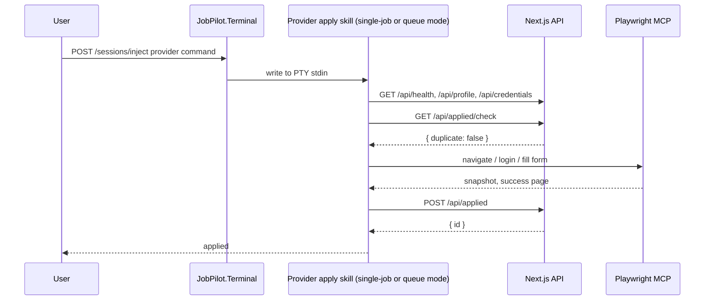

# Architecture

JobPilot is a web app, a provider terminal host, and provider plugins glued
together over HTTP and a single active PTY.

## The Three Pieces

**Next.js + SQLite web app** ([src/web/](../src/web/)) is the data and UI
layer. It owns every persistent fact: profile, applications by stage,
autopilot runs with per-job status, and the batch URL queue. Prisma schema is
split per domain under `src/web/prisma/schema/`.

**JobPilot.Terminal** ([src/JobPilot.Terminal/](../src/JobPilot.Terminal/)) is
an ASP.NET Core minimal API on `127.0.0.1:8001`. It owns one active provider
PTY (winpty via Quick.PtyNet) and bridges it to the web UI's xterm.js panel
over WebSocket. HTTP endpoints (`POST /sessions/start`, `POST /sessions/inject`,
`DELETE /sessions/current`, `GET /healthz`, `GET /ws`) let UI buttons write
provider-specific commands directly into the active provider's stdin. When
spawning a provider it also exports `JOBPILOT_SKILLS_ROOT` and
`JOBPILOT_WORKSPACE_ROOT` so wrappers can resolve shared skills without
filesystem inference.

**Canonical skill pack** ([src/jobpilot-skills/](../src/jobpilot-skills/))
holds the provider-neutral workflow instructions. Each workflow is a
directory `skills/<name>/SKILL.md`; shared imports live under
`shared/*.md`. Bodies use `<skill-name>-command` placeholders for cross-skill
references and the `${JOBPILOT_SKILLS_ROOT}` env var for shared files. This is
the only place skills are edited.

**Skill generator** ([scripts/sync-skills.ts](../scripts/sync-skills.ts))
reads the canonical pack and writes per-provider copies into each plugin's
`skills/` directory. For Claude, it keeps the full frontmatter and rewrites
`<X-command>` to `/jobpilot:X` and `${JOBPILOT_SKILLS_ROOT}` to
`${CLAUDE_PLUGIN_ROOT}/../jobpilot-skills`. For Codex, it strips
Claude-only frontmatter fields (`allowed-tools`, `disable-model-invocation`,
…) and rewrites `<X-command>` to `$X`. Both generated `skills/` trees are
gitignored; the script runs automatically via `predev`/`prestart` or on
demand with `bun run sync-skills`.

**Provider plugins** at
[src/jobpilot-claude-plugin/](../src/jobpilot-claude-plugin/) and
[src/jobpilot-codex-plugin/](../src/jobpilot-codex-plugin/) carry only the
manifest (`.claude-plugin/plugin.json` / `.codex-plugin/plugin.json`) and a
`.mcp.json` for the Playwright server. Terminal starts Claude Code with
`--plugin-dir src/jobpilot-claude-plugin`, or Codex with
`codex --no-alt-screen -C <repo>`. Codex has no `--plugin-dir` flag; it
auto-discovers
[.agents/plugins/marketplace.json](../.agents/plugins/marketplace.json) from
the working directory, which points at `src/jobpilot-codex-plugin`. On first
launch a user enables the plugin from the `/plugin` menu. Developers can also
run providers directly:

```bash
claude --plugin-dir src/jobpilot-claude-plugin
codex --no-alt-screen -C .
```

## Topology

```text
Browser (xterm.js)  <-- WS binary -->  JobPilot.Terminal :8001  <-- PTY -->  claude --plugin-dir src/jobpilot-claude-plugin
                    -- POST /inject -> JobPilot.Terminal                   or codex --no-alt-screen -C <repo>
Next.js :8000 API   <-- curl -------- JobPilot skills
                                      -> insert/update runs/jobs in SQLite
```

One Terminal instance owns one PTY. The PTY survives browser tab close;
reopening the terminal panel attaches a new WebSocket to the same live session.
Switching providers stops the current PTY and starts the selected provider.
There is no replay buffer, so use the active provider's terminal scrollback for
history.

## Plugin Layout

```text
src/jobpilot-skills/                       # canonical (edit these)
|-- shared/                                # setup, auth, form-filling, browser-tips
`-- skills/<name>/SKILL.md                 # one directory per workflow

scripts/sync-skills.ts                     # generator

src/jobpilot-claude-plugin/
|-- .claude-plugin/plugin.json
|-- .mcp.json
`-- skills/                                # generated, gitignored

src/jobpilot-codex-plugin/
|-- .codex-plugin/plugin.json
|-- .mcp.json
`-- skills/                                # generated, gitignored

.agents/plugins/marketplace.json           # makes Codex aware of the local plugin
```

The web app formats injected commands as `/jobpilot:<skill>` for Claude
(plugin namespace) and `$<skill>` for Codex (bare; the Codex plugin owns the
namespace by virtue of being the only installed plugin in this workspace).

Root `.claude/settings.json` grants the project permissions needed by the
skills. The plugin owns reusable behavior; the repository owns local trust and
permission policy.

## Request Lifecycle: A Single Apply Run



## Live Runs

Autopilot and apply create and update run rows through `/api/runs/*`.
The web UI opens `EventSource /api/runs/[id]/events`, receives in-process SSE
events, and invalidates the run detail query so the page refetches canonical
state from SQLite.

## Skills Layer

`src/jobpilot-skills/shared/setup.md` is the single source of truth for
loading config. Every skill hits `/api/health`, then
`GET /api/profile`, then `GET /api/credentials`. Resume access goes through
`data.defaultResumeAbsolutePath` from the profile endpoint, or
`GET /api/resumes/[id]/file` for a stream.

`auth.md`, `form-filling.md`, and `browser-tips.md` cover cross-cutting browser
behavior. `src/jobpilot-skills/skills/humanizer/SKILL.md` is chained from the
cover-letter and upwork-proposal workflows via the `<humanizer-command>`
placeholder, which the generator rewrites to the active provider's
invocation token.
