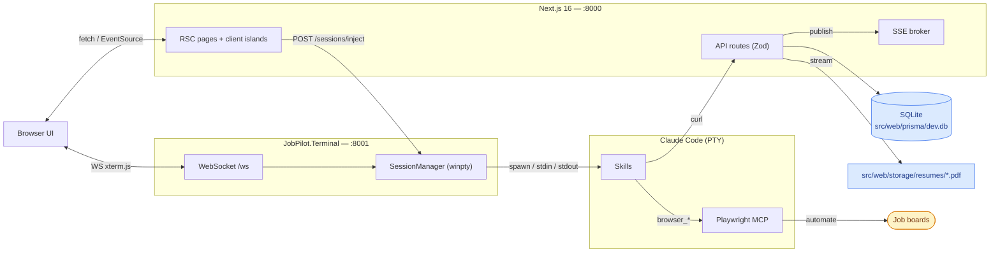
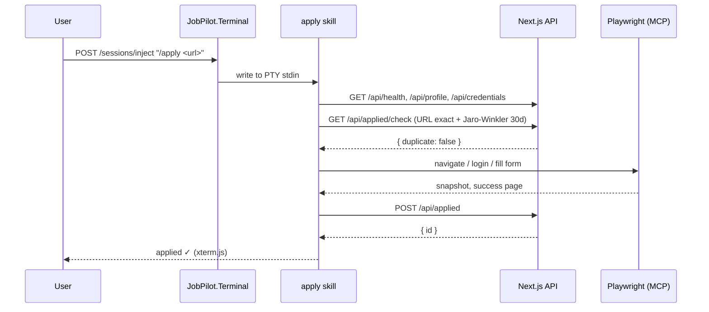
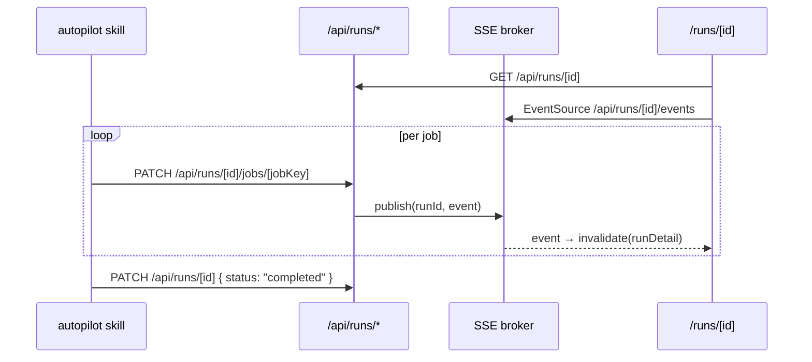

# Architecture

JobPilot is three pieces glued together over HTTP and a single PTY.

## The three pieces

**Next.js + SQLite web app** ([src/web/](../src/web/)) is the data + UI
layer. It owns every persistent fact: profile, applications by stage,
autopilot runs with per-job status, batch URL queue. Prisma schema is
split per domain under `src/web/prisma/schema/`.

**JobPilot.Terminal** ([src/JobPilot.Terminal/](../src/JobPilot.Terminal/))
is an ASP.NET Core minimal API on `127.0.0.1:8001`. It owns the `claude`
PTY (winpty via Quick.PtyNet, vendored from the user's
[stealth-code](https://github.com/suxrobGM/stealth-code) project) and
bridges it to the web UI's xterm.js panel over WebSocket. HTTP
endpoints (`/sessions/start`, `/sessions/inject`, `/sessions/current`,
`/healthz`) let UI buttons write slash commands directly into Claude
Code's stdin.

**Claude Code skills** under
[src/JobPilot.Terminal/.claude/skills/](../src/JobPilot.Terminal/.claude/skills/)
are markdown prompts: parse a job posting, score it against the resume,
drive Playwright to fill an application, write a cover letter. They
hold no state — everything goes through `curl http://127.0.0.1:8000/api/...`.
If the web app is down, skills stop with a clear message.

## Topology

```text
Browser (xterm.js)  ←─ WS binary ──→  JobPilot.Terminal :8001  ←─ PTY ──→  claude.exe
                    ── POST /inject ─→  JobPilot.Terminal           (stdin write)
Next.js :8000 API   ←── curl ─────────  claude skills
                                        └ insert/update runs/jobs in SQLite
```

`SessionManager.Start` runs `claude` with the working directory the
caller supplies (the web UI passes the JobPilot.Terminal install path),
so the spawned `claude` auto-discovers the local `.claude/skills/` and
`.mcp.json`. One PTY per JobPilot.Terminal instance, loopback only, no
auth. The PTY survives browser tab close; reopening attaches a new
WebSocket to the same live session (no replay buffer — scroll the
existing Claude Code session for history).

## File layout the PTY sees

```text
src/JobPilot.Terminal/
├── .claude/
│   ├── settings.json    ← permissions (curl, jq, date, Playwright MCP, Skill())
│   └── skills/
│       ├── _shared/     ← setup, auth, form-filling, browser-tips
│       ├── apply/SKILL.md
│       ├── apply-batch/SKILL.md
│       ├── autopilot/SKILL.md
│       ├── cover-letter/SKILL.md
│       ├── humanizer/
│       ├── interview/SKILL.md
│       ├── search/SKILL.md
│       └── upwork-proposal/SKILL.md
└── .mcp.json            ← Playwright MCP server
```

## High-level diagram



## Request lifecycle: a single `apply` run



## Live runs (autopilot / apply-batch)



`src/web/src/lib/sse.ts` is an in-process per-runId broker
(`Map<runId, Set<controller>>`, 15-second heartbeats). The browser
uses `EventSource` via `hooks/use-run-events.ts`, which invalidates
the run detail query on every event so the UI refetches canonical
state.

## Skills layer

`.claude/skills/_shared/setup.md` is the single source of truth for
"how does a skill load config?" — every skill hits `/api/health`, then
`GET /api/profile`, then `GET /api/credentials`. Resume access goes
through `data.defaultResumeAbsolutePath` from the profile endpoint, or
`GET /api/resumes/[id]/file` for a stream.

`auth.md`, `form-filling.md`, and `browser-tips.md` cover the
cross-cutting browser behaviors. The humanizer at
[src/JobPilot.Terminal/.claude/skills/humanizer/](../src/JobPilot.Terminal/.claude/skills/humanizer/)
is a vendored copy of the upstream humanizer skill, invoked internally
by the cover-letter and upwork-proposal skills.

## Web app layer

RSC-first. Most `app/<route>/page.tsx` files render a
`Container + Stack + PageHeader` server-side and descend into a
`*-content.tsx` client component for the data-fetching body.

Routes:

- **/** dashboard (KPIs, funnel, board breakdown, recent activity)
- **/applications**, **/applications/[id]** — stage funnel, manual
  transitions, fuzzy duplicate matching.
- **/runs**, **/runs/[id]** — live viewer over SSE.
- **/batch** — apply-batch URL queue.
- **/boards** — job-board CRUD.
- **/profile** — 7-tab editor (Personal, Address, Work auth, EEO,
  Autopilot, Credentials, Resumes).
- **/onboarding** — 5-step wizard.

### API surface

All under `/api/`, JSON in/out, response shape `{ ok, data | error }`:

- `/api/health`
- `/api/profile` GET/PUT  •  `/api/profile/default-resume` POST
- `/api/job-boards` GET/POST  •  `/api/job-boards/[id]` PATCH/DELETE
- `/api/credentials` GET/POST  •  `/api/credentials/[id]` PATCH/DELETE
- `/api/resumes` GET/POST (multipart)  •  `/api/resumes/[id]` DELETE  •
  `/api/resumes/[id]/file` GET (stream)
- `/api/applied` GET/POST  •  `/api/applied/check` GET  •
  `/api/applied/[id]` GET/DELETE  •  `/api/applied/[id]/stage` POST  •
  `/api/applied/export.csv` GET
- `/api/dashboard/stats` GET
- `/api/runs` GET/POST  •  `/api/runs/[id]` GET/PATCH  •
  `/api/runs/[id]/jobs` GET/POST  •  `/api/runs/[id]/jobs/[jobKey]`
  PATCH  •  `/api/runs/[id]/events` POST + GET (SSE)  •
  `/api/runs/stats` GET
- `/api/batch` GET/POST  •  `/api/batch/pending` GET  •
  `/api/batch/[id]` PATCH/DELETE

### Data

`src/web/prisma/schema/` holds one file per domain (`base`, `profile`,
`resume`, `credential`, `job-board`, `application`, `run`, `batch`).
Prisma 7's modern `prisma-client` generator emits TS into
`src/web/src/generated/prisma/`. Dev DB at `src/web/prisma/dev.db`.
Driver adapter is `@prisma/adapter-libsql` because better-sqlite3
fails to load under Bun on Windows.

`src/web/src/lib/matching.ts` runs Jaro-Winkler on normalized title +
company (seniority and legal-suffix tokens stripped, title 60% /
company 40%, threshold ≥ 90, 30-day window).

## Conventions

`CLAUDE.md` at the repo root holds the frontend rules: kebab-case
files, named exports (default only on `page.tsx`/`layout.tsx`), barrel
MUI imports, `interface` for `<Name>Props`, destructure props in the
function body, no `useCallback`/`useMemo`/`memo`, prefer `&&` over
`: null` ternaries, Zod imports from `zod/v4`. The DTOs in
`src/web/src/types/api/`, the structured `queryKeys` in
`src/web/src/lib/api/query-keys.ts`, and the typed primitives under
`src/web/src/components/ui/{data,display,feedback,form,layout}/` are
the load-bearing reuse points.
