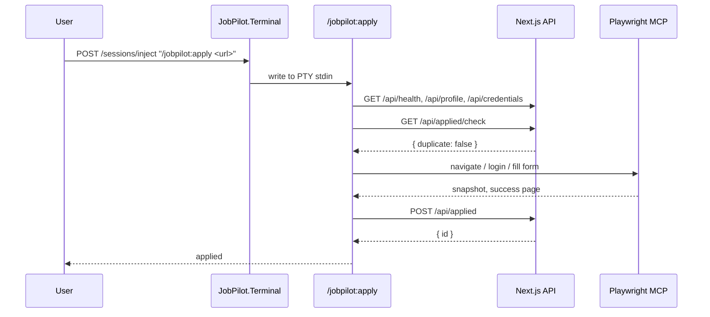

# Architecture

JobPilot is three pieces glued together over HTTP and a single PTY.

## The Three Pieces

**Next.js + SQLite web app** ([src/web/](../src/web/)) is the data and UI
layer. It owns every persistent fact: profile, applications by stage,
autopilot runs with per-job status, and the batch URL queue. Prisma schema is
split per domain under `src/web/prisma/schema/`.

**JobPilot.Terminal** ([src/JobPilot.Terminal/](../src/JobPilot.Terminal/)) is
an ASP.NET Core minimal API on `127.0.0.1:8001`. It owns the `claude` PTY
(winpty via Quick.PtyNet) and bridges it to the web UI's xterm.js panel over
WebSocket. HTTP endpoints (`/sessions/start`, `/sessions/inject`,
`/sessions/current`, `/healthz`) let UI buttons write slash commands directly
into Claude Code's stdin.

**JobPilot Claude Code plugin**
([src/jobpilot-claude-plugin/](../src/jobpilot-claude-plugin/)) contains the
skills and Playwright MCP config. Terminal starts Claude Code with
`--plugin-dir src/jobpilot-claude-plugin`, and developers can run the same
plugin directly from the repo root:

```bash
claude --plugin-dir src/jobpilot-claude-plugin
```

## Topology

```text
Browser (xterm.js)  <-- WS binary -->  JobPilot.Terminal :8001  <-- PTY -->  claude --plugin-dir src/jobpilot-claude-plugin
                    -- POST /inject -> JobPilot.Terminal                   /jobpilot:<skill>
Next.js :8000 API   <-- curl -------- JobPilot skills
                                      -> insert/update runs/jobs in SQLite
```

One Terminal instance owns one PTY. The PTY survives browser tab close;
reopening the terminal panel attaches a new WebSocket to the same live session.
There is no replay buffer, so use the existing Claude Code scrollback for
history.

## Plugin Layout

```text
src/jobpilot-claude-plugin/
|-- .claude-plugin/
|   `-- plugin.json        # name: jobpilot, namespace: /jobpilot:<skill>
|-- .mcp.json              # Playwright MCP server config
`-- skills/
    |-- _shared/           # setup, auth, form-filling, browser-tips
    |-- apply/SKILL.md
    |-- apply-batch/SKILL.md
    |-- autopilot/SKILL.md
    |-- cover-letter/SKILL.md
    |-- humanizer/
    |-- interview/SKILL.md
    |-- search/SKILL.md
    `-- upwork-proposal/SKILL.md
```

Plugin skills are namespaced. The web app injects `/jobpilot:autopilot` and
`/jobpilot:apply-batch`; direct Claude Code users run the same commands.

Root `.claude/settings.json` grants the project permissions needed by the
skills. The plugin owns reusable behavior; the repository owns local trust and
permission policy.

## Request Lifecycle: A Single Apply Run



## Live Runs

Autopilot and apply-batch create and update run rows through `/api/runs/*`.
The web UI opens `EventSource /api/runs/[id]/events`, receives in-process SSE
events, and invalidates the run detail query so the page refetches canonical
state from SQLite.

## Skills Layer

`src/jobpilot-claude-plugin/skills/_shared/setup.md` is the single source of
truth for loading config. Every skill hits `/api/health`, then
`GET /api/profile`, then `GET /api/credentials`. Resume access goes through
`data.defaultResumeAbsolutePath` from the profile endpoint, or
`GET /api/resumes/[id]/file` for a stream.

`auth.md`, `form-filling.md`, and `browser-tips.md` cover cross-cutting browser
behavior. The humanizer at
[src/jobpilot-claude-plugin/skills/humanizer/](../src/jobpilot-claude-plugin/skills/humanizer/)
is a vendored copy invoked by the cover-letter and upwork-proposal skills.

## Web App Layer

RSC-first. Most `app/<route>/page.tsx` files render a `Container + Stack +
PageHeader` server-side and descend into a `*-content.tsx` client component
for the data-fetching body.

Routes:

- `/` dashboard
- `/applications`, `/applications/[id]` stage funnel and manual transitions
- `/runs`, `/runs/[id]` live viewer over SSE
- `/batch` apply-batch URL queue
- `/boards` job-board CRUD
- `/profile` profile, credentials, resumes, and autopilot defaults
- `/onboarding` setup wizard

## API Surface

All under `/api/`, JSON in/out, response shape `{ ok, data | error }`:

- `/api/health`
- `/api/profile` GET/PUT and `/api/profile/default-resume` POST
- `/api/job-boards` GET/POST and `/api/job-boards/[id]` PATCH/DELETE
- `/api/credentials` GET/POST and `/api/credentials/[id]` PATCH/DELETE
- `/api/resumes` GET/POST, `/api/resumes/[id]` DELETE,
  `/api/resumes/[id]/file` GET
- `/api/applied` GET/POST, `/api/applied/check` GET,
  `/api/applied/[id]` GET/DELETE, `/api/applied/[id]/stage` POST
- `/api/dashboard/stats` GET
- `/api/runs` GET/POST, `/api/runs/[id]` GET/PATCH,
  `/api/runs/[id]/jobs` GET/POST, `/api/runs/[id]/jobs/[jobKey]` PATCH,
  `/api/runs/[id]/events` POST + GET, `/api/runs/stats` GET
- `/api/batch` GET/POST, `/api/batch/pending` GET,
  `/api/batch/[id]` PATCH/DELETE

## Data

`src/web/prisma/schema/` holds one file per domain. Prisma emits TypeScript to
`src/web/src/generated/prisma/`. Dev DB is `src/web/prisma/dev.db`. The app
uses `@prisma/adapter-libsql` because better-sqlite3 fails to load under Bun
on Windows.

`src/web/src/lib/matching.ts` runs Jaro-Winkler on normalized title + company
with seniority and legal-suffix tokens stripped.

## Conventions

`CLAUDE.md` at the repo root holds the coding conventions and current
repository context.
