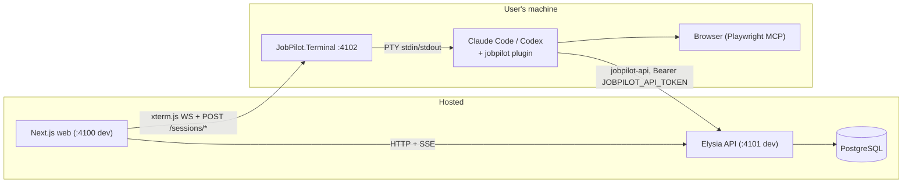
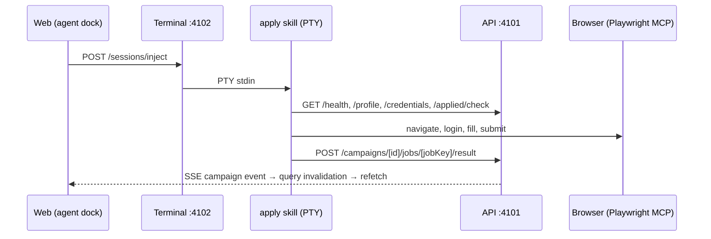

# Development guide

Technical reference for contributors. For a plain-language overview, read
[architecture.md](architecture.md) first.

## Local setup

```bash
git clone https://github.com/suxrobgm/jobpilot.git
cd jobpilot
bun install
bun run db:setup # generates the Prisma client, runs migrations, seeds default data
bun run dev      # web :4100 + api :4101 + terminal :4102
```

For a local PostgreSQL, the repo now ships one:

```bash
docker compose -f docker-compose.dev.yml up -d   # postgres:17 on :5433, named volume
bun run db:setup
```

`DATABASE_URL` in [apps/api/.env](../apps/api/.env) already points at `:5433`. The alternative is
any PostgreSQL you can reach, including the remote one through the SSH tunnel described below.

**If you are already running an ad-hoc `jobpilot-db` container, check its volume first:**

```bash
docker inspect jobpilot-db --format '{{range .Mounts}}{{.Name}}{{end}}'
```

A long hex name means an *anonymous* volume - `docker volume prune` deletes those without naming
what it removed, and everything the app owns (applications, resumes, pilot history) lives there
with no upstream copy. Take a dump before touching it, then move to the compose stack:

```bash
bun run db:backup
docker rm -f jobpilot-db
docker compose -f docker-compose.dev.yml up -d
bun run db:restore
```

Then open `http://localhost:4100` and open the Terminal panel.

### Remote database over SSH

To use a remote PostgreSQL, open an SSH tunnel and point the API at the local
end. Fill in the `SSH_TUNNEL_*`, `REMOTE_DB_*`, and `LOCAL_DB_PORT` variables
in [apps/api/.env](../apps/api/.env) (see
[apps/api/.env.example](../apps/api/.env.example) for the full list), then
run:

```bash
bun run db:tunnel   # forwards localhost:5433 to the remote database; Ctrl+C closes it
```

While the tunnel is open, set
`DATABASE_URL=postgresql://<user>:<pass>@localhost:5433/<db>` in
[apps/api/.env](../apps/api/.env). `db:setup`, `db:studio`, and the API then
all talk to the remote database.

Set `REMOTE_DB_HOST` to `127.0.0.1` if PostgreSQL runs on the SSH server
itself. If you're going through a bastion host, set it to the database's
private address instead.

### Backups

The database is the only copy of your applications, resumes and pilot history - nothing upstream
can re-supply it.

```bash
bun run db:backup            # backups/jobpilot-<utc>.dump, keeps the newest 14
bun run db:restore           # newest dump; refuses unless you type "restore"
bun run db:restore path.dump
```

`db:backup` reads each dump back with `pg_restore --list` before reporting success, because a dump
that cannot be read is not a backup. `db:restore` runs in a single transaction, so a failed restore
leaves the database as it was. Dumps are gitignored - they contain real applications.

## Repository layout

- [apps/web/](../apps/web/): the hosted Next.js dashboard (dev `:4100`).
- [apps/api/](../apps/api/): the hosted Bun + Elysia + Prisma API. It owns
  all state (dev `:4101`, Swagger at `/swagger`).
- [apps/terminal/](../apps/terminal/): a .NET host that runs on each user's
  machine and connects one Claude Code or Codex terminal session to the
  dashboard (dev `:4102`).
- [plugin/](../plugin/): one plugin shared by Claude Code and Codex. It holds
  the skills, worker subagents, and Playwright MCP config. There's no build
  step.
- [packages/](../packages/): shared Zod contracts and the typed Eden Treaty
  API client.

## Tech stack

| Layer              | Choice                                         |
| ------------------ | ---------------------------------------------- |
| Runtime            | Bun 1.3                                        |
| Web                | Next.js 16 (App Router, RSC, typed routes)     |
| UI                 | MUI 9 + MUI X DataGrid                         |
| Forms              | TanStack Form 1 + Zod v4                       |
| Server state       | TanStack Query 5                               |
| API                | Elysia + Eden Treaty (end-to-end types)        |
| Database           | PostgreSQL via Prisma 7 + `@prisma/adapter-pg` |
| Realtime           | In-process SSE channels                        |
| Terminal host      | .NET 10 ASP.NET Core, ConPTY via Quick.PtyNet  |
| Browser automation | Playwright via the Playwright MCP server       |

## How the pieces fit

The web app and API are hosted and shared by all users. Each user runs a
terminal host and the provider plugin on their own machine. The local agent
calls the API as the signed-in user, using a personal access token that the
terminal host puts into the session's environment.

### Topology



### Web

[apps/web/](../apps/web/) is the Next.js UI: the application pipeline,
campaigns with live per-job progress, inbox, networking, the resume studio,
Upwork (proposals, profile, inbox), analytics, settings, and the agent dock.
The dock is an xterm.js panel that installs, starts, and monitors the local
agent.

Both the browser and the Next.js server call the API directly through
`API_BASE_URL`. Nothing proxies data in between.

### API

[apps/api/](../apps/api/) is Elysia + Prisma and owns all state. It serves a
typed `/api/*` surface, with Swagger at `/swagger`. The Prisma schema is split
by domain under `apps/api/prisma/schema/`.

### Terminal host

[apps/terminal/](../apps/terminal/) is an ASP.NET Core minimal API that owns
one provider PTY (ConPTY via Quick.PtyNet). It streams that PTY to the web's
xterm.js over a WebSocket.

Endpoints: `POST /sessions/start`, `POST /sessions/inject`,
`DELETE /sessions/current`, `GET /healthz`, `GET /ws`.

`/sessions/start` takes the user's terminal token and starts the provider
with these environment variables:

- `JOBPILOT_API_TOKEN`, `JOBPILOT_API`, and `JOBPILOT_WEB`
- `JOBPILOT_SKILLS_ROOT` and `JOBPILOT_WORKSPACE_ROOT`, for wrappers
- `plugin/bin` at the front of `PATH`

That's what lets skills call the API through `jobpilot-api` with no manual
setup.

Each terminal host owns one PTY, and the session outlives the browser tab.
When the panel reopens, it reconnects a WebSocket to the running session and
replays the most recent output (`TerminalRelay`, 512 KB, cleared when a new
session starts). Switching providers restarts the PTY.

The web sends skills as `/jobpilot:<skill>` for Claude and `$<skill>` for
Codex. When a new release is out, the dock shows an update banner. The guided
update replaces the host and plugin and, on Claude, finishes with
`/reload-plugins`.

### Plugin loading

[plugin/](../plugin/) is a single tree used by both providers, with no
generation step:

- `skills/<name>/SKILL.md`: one workflow per folder. Shared docs live in
  `skills/_shared/`, which has no `SKILL.md`, so neither provider lists it as
  a skill. Skills refer to each other by name and to shared docs by relative
  path (`../_shared/<doc>.md`), so the same text works for both providers.
- `agents/*.md`: worker subagents (`job-scorer`, `job-applier`,
  `job-searcher`, `networking-worker`). Campaign skills hand them one item at a
  time so heavy browser output stays out of the main session. Each worker
  includes the rules it needs instead of reading shared docs, and uses the
  session's model. Claude finds them on its own; the host writes Codex copies
  (see below). Runtimes without subagents do the work inline.
- `.mcp.json`: the Playwright MCP server.
- `.claude-plugin/plugin.json` and `.codex-plugin/plugin.json`: the provider
  manifests. Codex ignores Claude-only frontmatter like `allowed-tools`.
- `settings/claude.json` and `settings/codex.json`: agent settings shipped
  with the plugin. They aren't named `settings.json` at the plugin root
  because that name is reserved and only honors the `agent` and
  `subagentStatusLine` keys.

The terminal host starts the providers like this:

```text
claude --permission-mode auto --settings plugin/settings/claude.json --plugin-dir plugin
codex --no-alt-screen --approve-for-me -c <override>
```

Both run with automatic approval review, so a blocked action shows up as a
prompt in the dashboard terminal. `settings/claude.json` pins Sonnet and
describes the JobPilot API under `autoMode.environment`.

Codex has no `--settings` flag, and it only loads a project
`.codex/config.toml` for trusted projects. So
[CodexProvider](../apps/terminal/Providers/CodexProvider.cs) turns
`settings/codex.json` into `-c` arguments. If the file is missing, it logs a
warning and starts anyway.

Codex has no `--plugin-dir` either. Before each launch the host:

- copies the skill tree into `<root>/.agents/skills`, where Codex looks for
  repository skills (leaving out the marketplace-owned `setup` skill),
- turns the bundled `.mcp.json` into `-c mcp_servers.*` overrides,
- writes `<root>/.codex/agents/*.toml` from `plugin/agents/*.md`, with each
  body inlined as `developer_instructions`, so Codex gets the same workers.

Both provider marketplaces contain only `setup`. The full skill tree comes
from the host. The marketplace copies are published to
[claude-plugins](https://github.com/suxrobGM/claude-plugins) and
[codex-plugins](https://github.com/suxrobGM/codex-plugins), synced from
`plugin/` on each release tag. The root `.claude/settings.json` only sets
trust policy for this repo; behavior belongs to the plugin.

### Apply lifecycle



### Live updates

Skills write through `/api/campaigns/*`. The web opens
`EventSource /api/campaigns/[id]/events` and, on each event, invalidates the
TanStack Query cache so the page refetches the real state from PostgreSQL.
Five more channels (`workspace`, `inbox`, `resume`, `upwork`, `pilot`) work
the same way. They're defined in `packages/contracts/src/sse/channels/`.

### Skills

`plugin/skills/_shared/setup.md` is the one place that defines how skills
load config:

1. `/api/health`
2. `GET /api/user` (the payload comes back bare, with no `data.` wrapper)
3. `GET /api/credentials/resolve?domain=…`
4. Resumes through `primaryResumeSourceAbsolutePath` or
   `GET /api/resumes/[id]/pdf`

The other shared docs cover browser behavior that many skills need:
`auth.md`, `form-filling.md`, and `browser-tips.md`. `campaign-flow.md` holds
the campaign steps every apply skill shares (the applied check, result writes,
worker input, and rules). Skills that write text call the `humanizer` skill by
name in **embedded mode**, so only the final text comes back.

The resume skills form a chain, and each has one rule:

- `extract-resume` copies the PDF into `ResumeData` word for word. It doesn't
  improve anything or invent fields. On a *first* extraction it then runs
  `review-resume`. `--force` skips that step, because the user asked for
  exactly what the PDF says.
- `review-resume` writes one `Suggested rewrite` variant whose `diffNotes`
  list every change. It never edits a base resume. The dashboard's Apply
  button does that through `POST /api/resumes/variants/[id]/apply`, which
  copies the content onto the base and deletes the variant in one
  transaction, so a suggestion can't be applied and still be on offer. The
  stored source PDF is always there to go back to.
- `tailor-resume` owns per-job variants: choosing the base, deciding whether to
  reuse a variant or make a new one, rewording entries, and `structure`
  (reordering, dropping, merging, and promoting projects).

The server guards live in `apps/api/src/modules/resume/tailoring/`, and they
are the core of the design. In `structure.ts` the model only chooses *which*
entries to combine. The server works out every date and only accepts known
umbrella employer names, so no request can add an employer or stretch a date
range.

The wording checks are split by concern:

- `facts.ts` knows what the resume actually states: its numbers and its tech
  names.
- `guards.ts` checks reworded bullets against their originals, checks the
  summary and headline against the base, and rejects stock phrasing that
  reads as machine-written.
- `entries.ts` handles merges and promotions, including retitling.

Anything a check can prove wrong returns a 422 instead of a warning. A
warning is something the agent repeats and moves past, which means a made-up
claim the user never sees. The one warning left is for a new job title that
shares no word with the old one, because that test is only a guess. "SWE II"
to "Software Engineer" is an honest expansion with no shared word, and
rejecting it would do more harm than flagging it.

## Tuning the apply loop

One application is model- and page-bound at roughly five minutes and will not
itself get much faster; the levers below are about how many tool calls one takes. Measure each with the
same instrument, and change one thing at a time.

`--save-session` in [plugin/.mcp.json](../plugin/.mcp.json) records every tool
call. Sessions land under the gitignored `.playwright-mcp/` and hold typed form
values (address, phone, salary) - keep them there. Then:

```bash
bun apps/api/scripts/analyze-apply-session.ts
```

It reports tool calls per session and a per-tool breakdown, including
per-field fill calls against batched ones - the number that should collapse now
that a form page is filled with a single `browser_fill_form`.

**Snapshot mode** is an open experiment. `--snapshot-mode none` keeps snapshots
out of every action response, which is fewer tokens but means an explicit
`browser_snapshot` to see what an action did. `full` returns the new state with
each action - more tokens, fewer round trips. Which wins depends on how large
your boards' pages are, and batching the fills changed the balance. Run a
campaign each way and compare calls per application before settling.

Not on the table: caching cover letters. `cover-letter`'s Step 2 reads the last
five specifically so a new one does not resemble them; reuse would defeat the
skill. Moving generation off the apply's critical path would need a separate
preparation step, which is only worth building once a session capture shows how
much of the five minutes it actually is.
